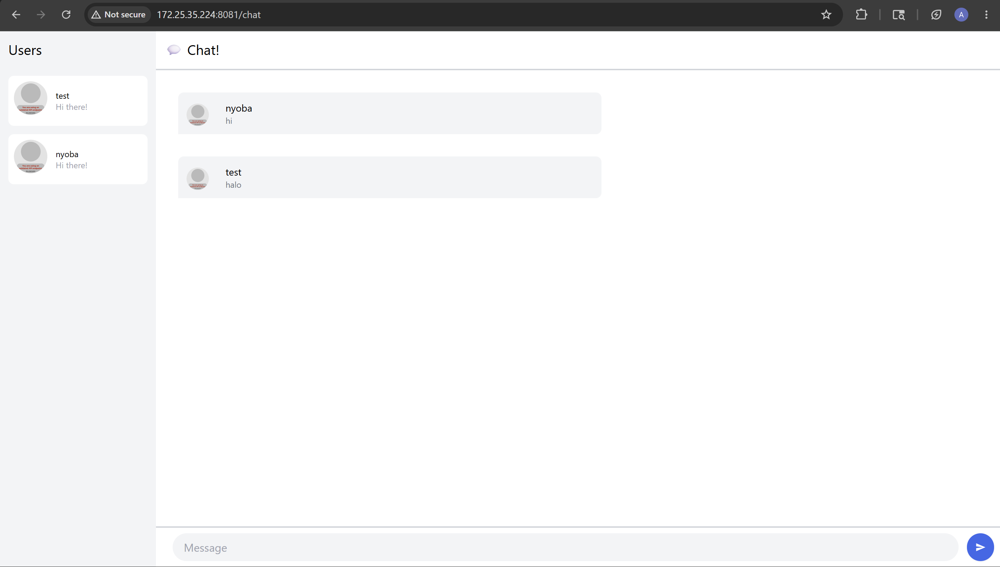
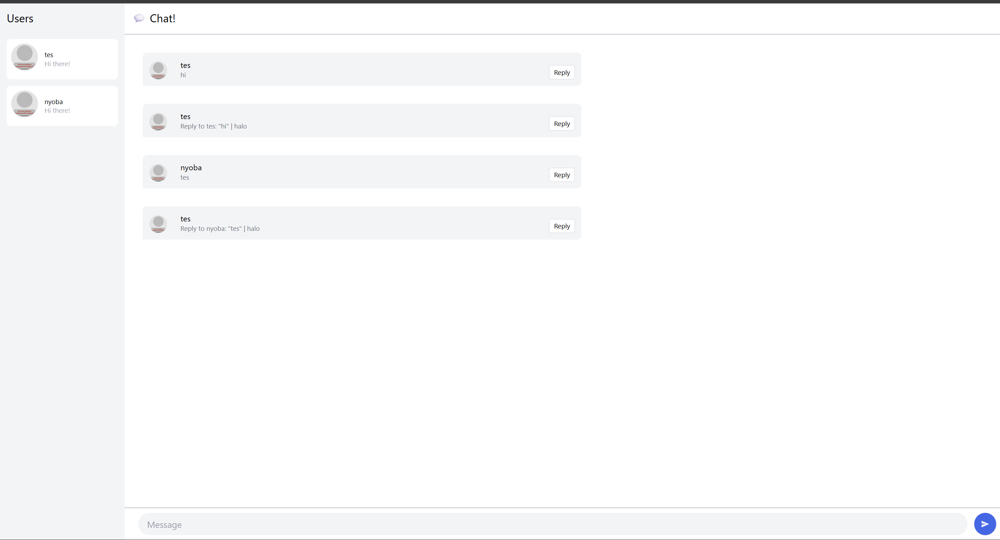
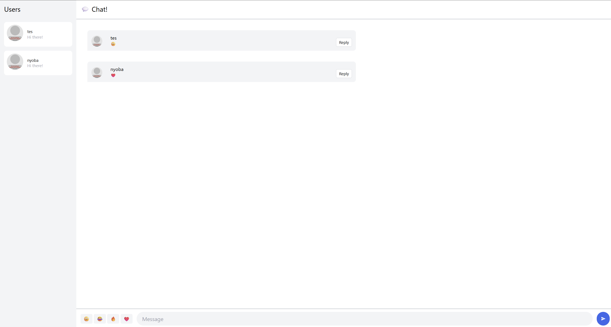

# Modul-10-Asynchronous-Programming-webchat

## Reflection

### Original Code

### Be Creative!

Saya menambahkan fungsionalitas untuk membuat reply dan juga mengirim emoji. Saya memilih dua fitur tersebut karena mereka adalah salah satu fitur terpenting untuk dimiliki oleh sebuah aplikasi chat dan aplikasi chat ini belum memiliki fitur tersebut.